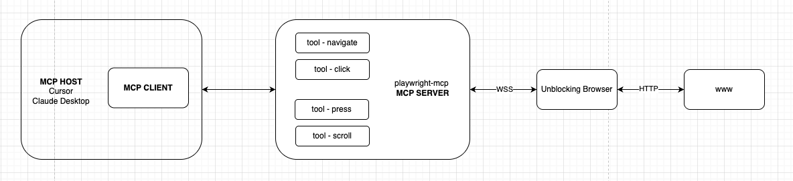
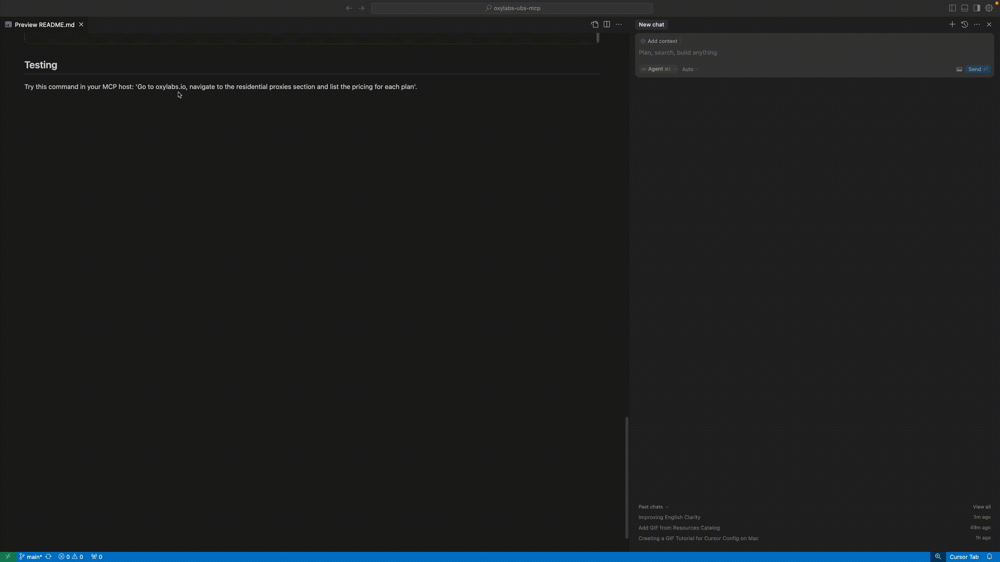

# oxylabs-unblocking-browser-mcp

## Oxylabs Unblocking Browser

Unblocking Browser enables you to run and control remote browsers without the complexity of managing them locally or on your own infrastructure. It provides a seamless way to execute browser-based automation, testing, and web scraping without dealing with browser setup, resource constraints, or detection challenges.

For detailed information, please refer to the official Oxylabs documentation: [documentation](https://developers.oxylabs.io/scraper-apis/unblocking-browser)

## Integration with MCP Server

To integrate unblocking browser with MCP, you'll need:
- Node.js with npx for launching playwright-mcp
- An MCP host with MCP client (Claude Desktop or Cursor)
- MCP server configuration with unblocking browser endpoint credentials.

### How It Works

The MCP host (like Cursor) comes with a built-in MCP client. Playwright-mcp acts as an MCP server, and instead of using a local browser, it connects to unblocking browser via a secure WebSocket connection (WSS).



## Setup Guide

### Prerequisites

1. Oxylabs Account: Obtain your username and password from Oxylabs for the Unblocking Browser product;

2. Install Node.js (version 18 or higher) and npm (which includes npx):
   - Node.js version 18.0.0 or higher is required for Playwright MCP
   - npm is included with Node.js installation
   - **Windows**: 
     - Download and install from [nodejs.org](https://nodejs.org/)
     - Administrator privileges required for installation
   - **macOS**:
     - Using Homebrew: `brew install node` (requires sudo privileges)
     - Alternatively, download from [nodejs.org](https://nodejs.org/)
   - **Linux**:
     - Ubuntu/Debian: `sudo apt update && sudo apt install nodejs npm`
     - Fedora: `sudo dnf install nodejs npm`
     - Alternatively, download from [nodejs.org](https://nodejs.org/)

3. Prepare your MCP server configuration:

```json
"oxylabs_unblocking_browser": {
    "command": "npx",
    "args": [
        "@playwright/mcp@latest",
        "--cdp-endpoint",
        "wss://<username>:<password>@ubc.oxylabs.io"
    ]
}
```

Note: Replace `<username>` and `<password>` with your Oxylabs credentials. This configuration uses a secure WebSocket connection to UBS instead of a local browser.

### Integration with Cursor

1. Open Cursor;
2. Open Cursor settings;
3. Select MCP
4. Add the prepared MCP server configuration
5. Restart Cursor


### Integration with Claude Desktop

1. Open Claude Desktop
2. Open Claude Desktop settings
3. Navigate to Developer
4. Press Edit Config
3. Edit the `claude_desktop_config.json` file
4. Add the prepared MCP server configuration
5. Restart Claude Desktop


## Testing

Try this command in your MCP host: `Go to oxylabs.io, navigate to the residential proxies section and list the pricing for each plan`.


